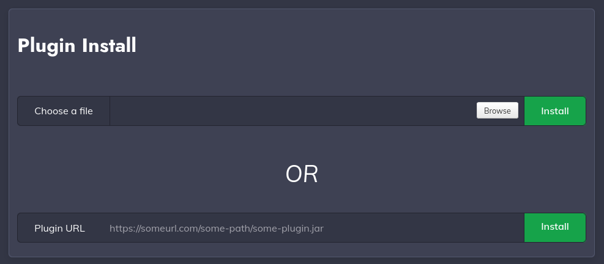
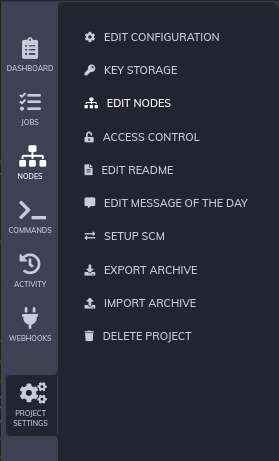

Rundeck Rudder Nodes Plugin
===========================

Version: 2.3

This is a Resource Model Source plugin for [Rundeck][] 3.3.x and up that provides
Rudder nodes as nodes for the Rundeck server.

[Rundeck]: http://rundeck.org

It works with Rudder standard API v12 for Rudder 6.x and up.

Installation
------------

Download the latest `rundeck-rudder-nodes-plugin-X.Y.jar` from the [releases page](https://github.com/Normation/rundeck-plugin-rudder/releases).

Alternatively, you can build the project from source with Maven (`mvn install`) and use the resulting jar from your local repository (see Maven console output for the exact location).

> **_NOTE:_** This plugin is old, and requires JDK 1.8.X and Maven 3.3.3

In order to install the plugin in Rundeck, open the **System** menu (gear icon on the **top right**) > **Plugins** > **Upload plugin**.

You can now upload the plugin `.jar` file.

When you navigate to the **System** > **Plugins** > **Installed plugins** page, the Rudder Resources plugin should appear.

SSH Authentication
------------------

By default, Rundeck uses SSH with private key authentication in order to log into your nodes. Hence, you will need a single SSH key that will be used to log into all the Rudder nodes you want to manage with Rundeck.

If you already have a SSH key that is authorized on all the Rudder nodes you want to manage, you can directly proceed to the **Creating a Rudder API Token** section.

Otherwise, the easiest way to authorize this key when you have a large number of nodes is to create a new Rudder Directive that will automatically add the new authorized key to your Rudder nodes.

Firstly, generate a new SSH key if needed. Then, in the Rudder interface, select **Configurations** > **Directives** in the sidebar.

In the Directives tree, find the **SSH Authorised Keys** technique (under **System Settings** > **Remote access**). Click the "Create" button.

After picking a name in the **Information** tab, navigate to the **Parameters** tab to configure your directive. 
- **Key tag** : a descriptive tag for your SSH key (this tag will not be used in your nodes' `authorized_keys` file).
- **Username** : set this field to `rundeck`
- **Key** : the public SSH key that will be authorized for all the Rudder nodes you want to manage. It will be inserted in the `authorized_keys` file of the `rundeck` user of each node.

Now, let's create a new rule that will apply this Directive. In the sidebar, select **Configuration** > **Rules**. 

Click the **Create** button to create a new rule.

Pick a name for the rule. Then, in the **Directives** tab, select your new directive.

In the **Groups** tab, select a group that contains all the Rudder nodes you wish to import into Rundeck (it is recommended that you create a new group).

Save your changes to apply the directive to all the chosen nodes. If the directive was successfully applied, your public key will have been added to the `authorized_keys` file of the `rundeck` user in each of your Rudder nodes.

Creating a Rudder API Token 
---------------------------

In order to access your Rudder nodes from Rundeck, you will need a Rudder API token. It is recommended that you create a new one. This step requires the `api-authorization` Rudder plugin.

In the Rudder interface, select **Users & access** > **API accounts** in the sidebar.

Click the **Create an account** button. Choose a fitting name for the token, and under **Access level**, choose "Custom ACL".

The only required rights are `GET groups` and `GET nodes`. Select them both.

After you click "Save", the token value will be displayed. Write it down as this token will be needed in the next step. 

Importing your Rudder nodes into Rundeck
----------------------------------------

We can now import our Rudder nodes into Rundeck. In the Rundeck interface, select **Project Settings** (gear icon on the **bottom left**) > **Edit nodes**.

In the "Nodes" menu, click the "Add a new Node Source" button.

Select the "Rudder Resources" option.

You can now configure your Rudder node source :
- **Rudder base URL** : the Rudder url of your company, e.g. https://my.company.com/rudder/ 
- **API token** : the Rudder API token you have created earlier.
- **Rundeck user** : set this field to `rundeck`

After saving your changes, your Rudder nodes should now be listed alongside your existing nodes when you navigate to the "Nodes" page. 

> **_NOTE:_** The Rudder Groups your nodes are in will be imported as Tags in Rundeck.

> For more information on Node Sources, see the Rundeck documentation for [Resource Model Sources](https://docs.rundeck.com/4.14.1/manual/projects/resource-model-sources/).

Usage
-----

> Make sure that the IP addresses of the Rudder nodes can be resolved by the rundeck server. In practice, this means that the Rudder nodes you want to manage should be included in your company's DNS record, or the `/etc/hosts` file of the rundeck server, or whichever way you choose to resolve IP adresses.

You can now run jobs and commands on your imported Rudder nodes like you would on any Rundeck node. To test this out, create a Job with a single Workflow step (e.g. an `echo` shell command ), and try to run it on your Rudder nodes.

If the execution succeeds on all your nodes, you're all set !

Release notes
-------------

2.3: normalize node attribute names

2.2: add support for Rudder 8.x.

2.1: update to rundeck-core version 3.3.18-20220118 (multiple vulnerabilities fixes)

2.0: add support for Rudder 6.x. Update to rundeck-core version 3.3 

1.x: support for Rudder < 6.0

